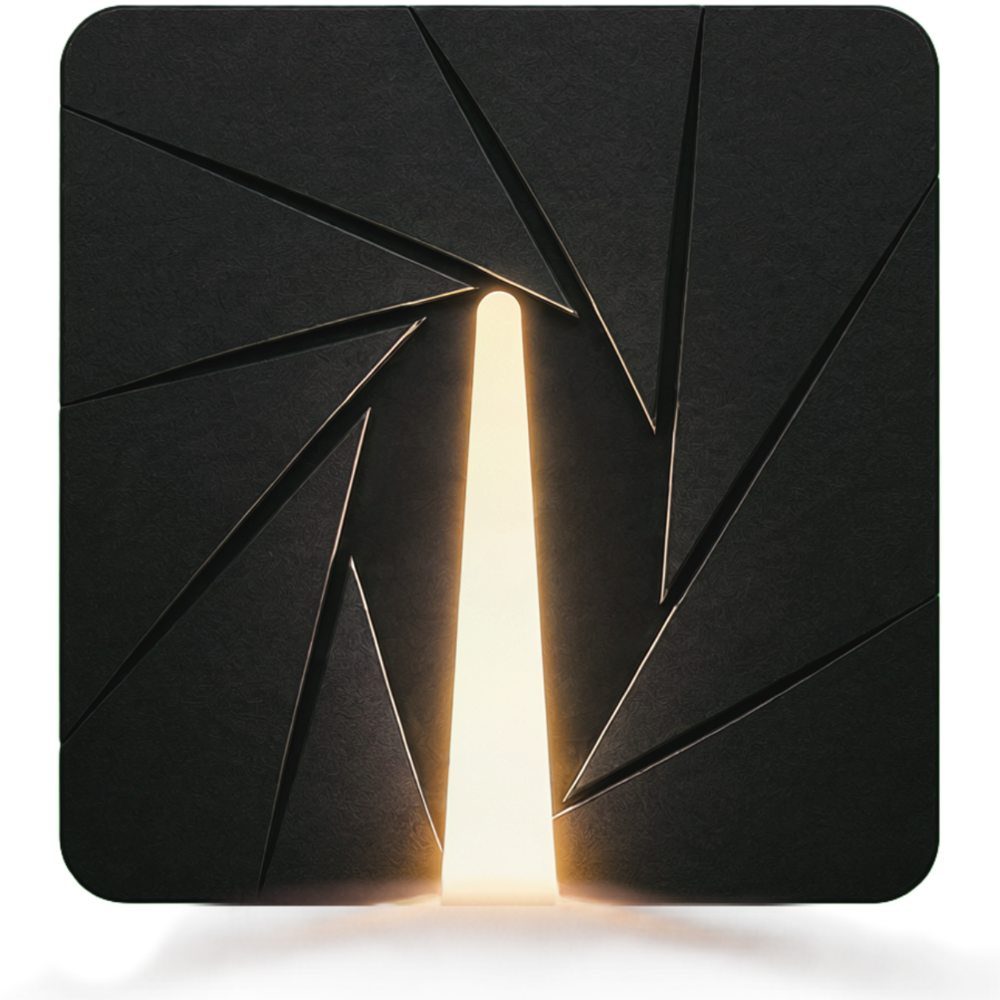
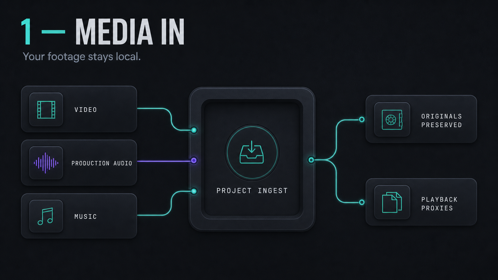
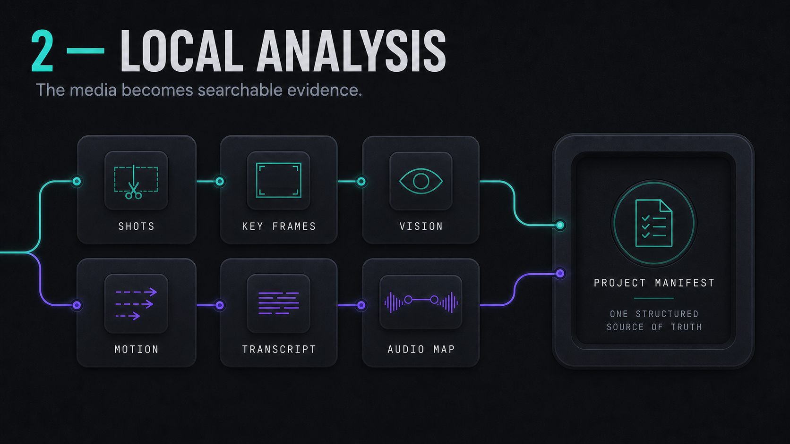
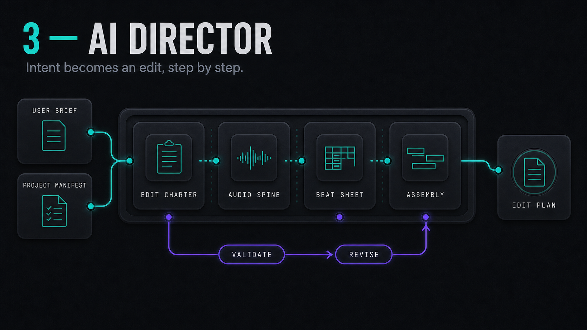
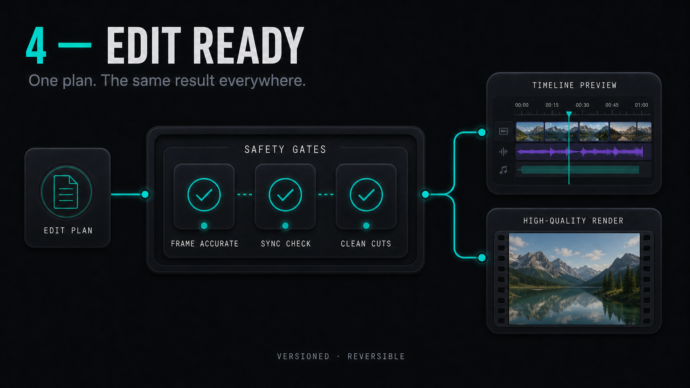

<h1 align="center">
   
  
</h1>

<strong>Local-first AI rough cuts that bridge into your NLE.</strong>

Cinelith is a desktop AI editing assistant: analyze your footage on your machine, get a rough cut, then hand off into Premiere, DaVinci Resolve, Final Cut, and friends — without locking you into a cloud NLE.

> Source code is not public yet. This repository is the public home for stars, releases, and updates while we build in private.

## How Cinelith works

Cinelith keeps the source media local and separates deterministic media analysis from editorial reasoning. The four stages below show how footage becomes a validated, editable timeline.

### 1. Media in

Video, production audio, music, subtitles, and visual assets enter one local workspace. Original files remain untouched. Cinelith probes their technical properties and creates lightweight playback proxies only when needed.

The resulting media inventory gives every asset a stable identity. This lets later stages reference exact sources and time ranges without destructively altering the originals.

### 2. Local analysis

Local analysis detects shots, keyframes, visual content, spatial composition, motion, speech, speakers, audio quality, synchronization, and relevant music structure. These signals are fused into one structured Project Manifest.

This Manifest is the evidence layer of the system. It records what the media contains and where it occurs; it does not make final editorial decisions.

### 3. AI Director

The AI Director first interprets the Manifest and creative brief as a proposed scenario. The planned approval workflow presents that interpretation to the user—including media-fit conflicts, trade-offs, and the intended edit direction—before Charter, Audio Spine, Beat Sheet, candidate selection, and final Assembly proceed.

Only compact structured evidence and selected contact sheets are sent to the chosen LLM backend. Deterministic validation then checks the returned edit plan instead of trusting model output blindly.

### 4. Edit ready

Safety gates verify media bounds, frame accuracy, picture/audio sync, dialogue integrity, subtitle timing, and clean cuts. Accepted plans are stored as reversible versions and compiled into one canonical timeline contract.

The in-app Timeline Preview and the high-quality MP4 renderer consume that same contract. This preview/render parity is a core product requirement, not a best-effort approximation.

## Roadmap

Synced with the product website roadmap — what already ships today, and what we’re building next.

### Done

- [x] **Local-first analysis** — 100%  
  Footage is analyzed on your machine into a structured Project Manifest.
- [x] **AI Director validated plans** — 100%  
  Staged planning with hard gates — not a blind one-shot LLM cut.
- [x] **Preview / render parity** — 100%  
  Timeline Preview and high-quality render share the same edit contract.
- [x] **Subtitle parity** — 100%  
  Burned-in captions match between preview and final render.
- [x] **High-quality MP4 delivery** — 100%  
  Export a finished, frame-accurate rough cut as a local MP4.

### Next

- [ ] **First .exe release** — 70%  
  Ship the initial Windows desktop installer so creators can download and run Cinelith locally.
- [ ] **Official MCP server** — 50%  
  First-party Model Context Protocol server so agents can drive Cinelith safely.
- [ ] **Richer website examples** — 0%  
  New example lanes — AI movie & series, cartoon, chaotic social cuts, and motion graphics.
- [ ] **In-app scenario review** — 0%  
  Approve or revise the Director’s scenario before assembly continues.
- [ ] **Deeper Timeline + Director notes** — 0%  
  Richer edit tools and per-cut notes that steer the next Director loop.
- [ ] **NLE export & validation** — 0%  
  OTIO / EDL / FCPXML / AE JSX packages, proven by real Premiere, Resolve, FCP, and AE imports.
- [ ] **macOS & Linux support** — 0%  
  Marked Available only after GitHub installs clear real-machine QA.
- [ ] **AMD & Apple Metal acceleration** — 0%  
  GPU paths beyond today’s CUDA-first stack for broader machines.
- [ ] **Minimum-spec system benchmarks** — 0%  
  Publish measured benchmarks for the target minimum hardware configurations.
- [ ] **In-app effects & transitions** — 0%  
  LLM-chosen looks that stay matched and bridged into target NLEs.
- [ ] **In-app motion graphics engine** — 0%  
  Beat-aware titles and overlays rendered inside Cinelith.
- [ ] **Local LTX 2.3 on the Timeline** — 0%  
  Generate video clips locally with LTX 2.3 and drop them into the cut.
- [ ] **API video generation on the Timeline** — 0%  
  Pull generations from Seedance 2.0, LTX 2.3, Kling, and similar APIs into the edit.

## Stay in the loop

- Star this repo to get notified of releases
- Watch **Releases** for the first Windows build
- Issues and discussions will open when the public beta starts

## What Cinelith is (and is not)

| Cinelith is | Cinelith is not |
|---|---|
| A local AI rough-cut assistant | A replacement for your NLE |
| Privacy-minded (footage stays on your machine) | A mandatory cloud render farm |
| A bridge into professional editors | A locked proprietary timeline format |

## Attribution

Workflow infographics use media from the publicly available
[DaVinci Resolve training resources](https://www.blackmagicdesign.com/products/davinciresolve/training)
published by Blackmagic Design. Blackmagic Design is not affiliated with and does not endorse Cinelith.

---

© Uniqornate · Built for editors who already have a favorite NLE.
